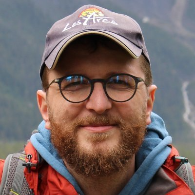

# A bit about me

I am an associate professor (*Maître de Conférences*) at [Université Paris Cité](https://u-pariscite.fr/) in computational biology / bioinformatics.

Computational Biology / Comparative Genomics

Associate Professor (*Maître de Conférences*)

[Université Paris Cité](https://u-pariscite.fr/) -- [Institut Jacques Monod](https://https://www.ijm.fr/)

::: column-margin
{fig-alt="This is me" fig-align="right" width="5cm"}
:::

# Research interests & projects

- Comparative genomics
- Evolutionary genomics
- Molecular evolution
- Computational biology
- Functional genomics

You can find more details about my current & past research projects [here](projects.qmd).

You can also find a list of publications [here](publications.qmd).

# Teaching
